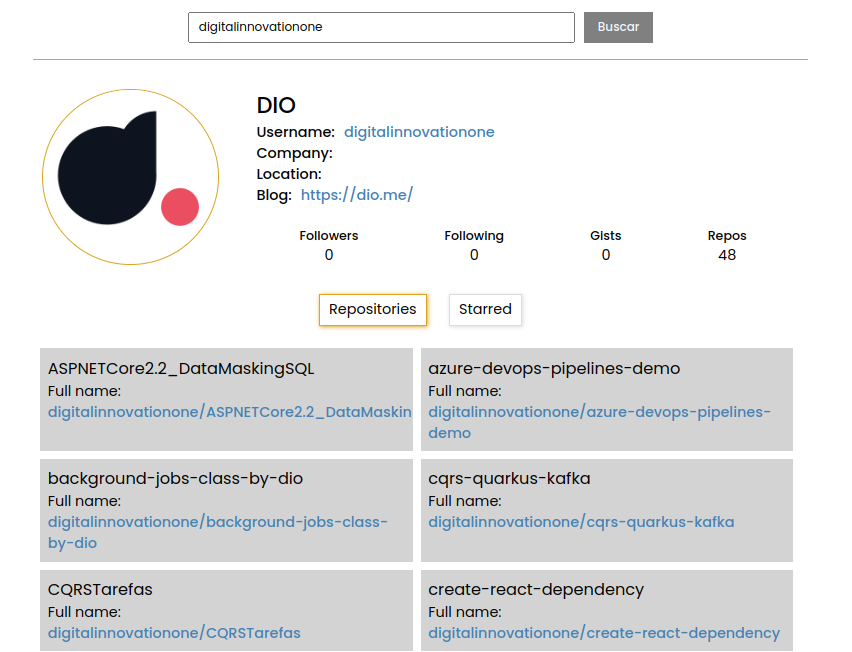

# github-interface-api

Página que exibe o perfil do github do usuário baseado nas informações disponibilizadas na API do Github.


Desenvolvido totalmente componentizado utilizando ReactJS, estilização com Styled-components e chamadas na API do Github com o Axios.

Para executar:

Após clonar o repositório, acessar a pasta via terminal e executar:


```

npm install

```


Exemplo de exibição após a pesquisa com sucesso:



